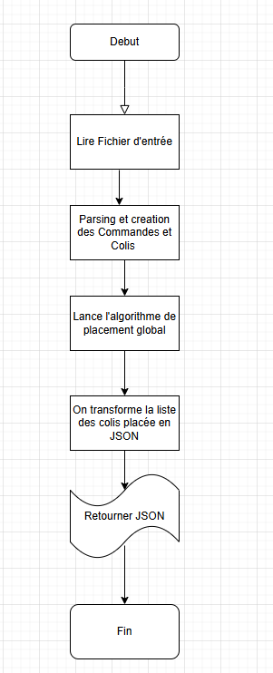
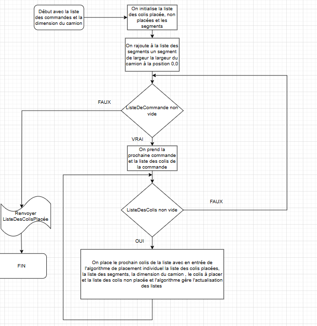
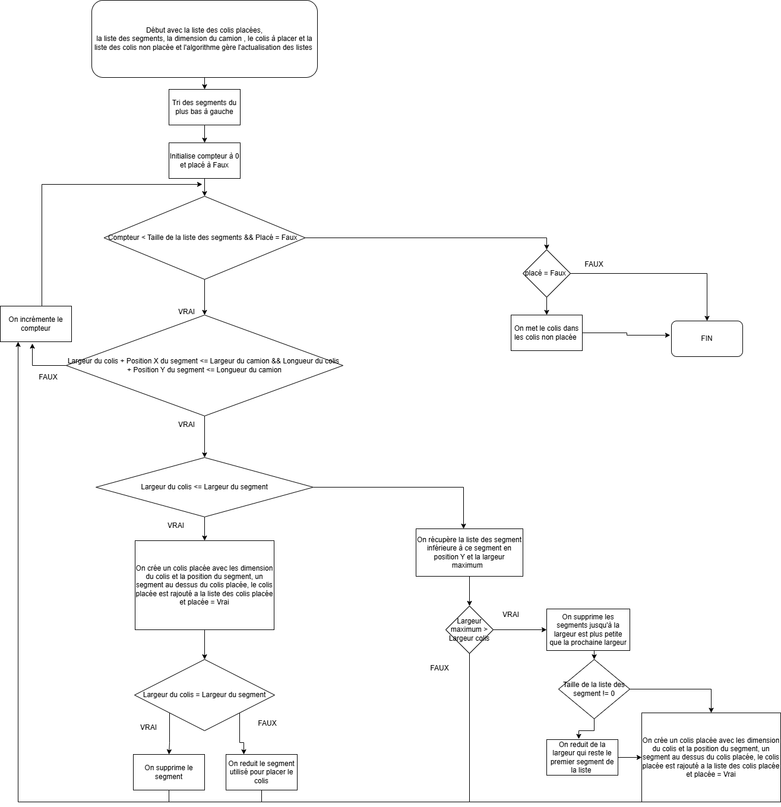

# Projet de C++ dans le cadre d'un PRI d'optimisation de placement d'objet en 3D. 
Le projet à été crée sur Visual studio et avec un visualisateur en Python. 
 
## Diagramme de classe 
Voici le diagramme de classe du projet.

## Diagramme de flux / Use Case
Voici les diagrammes qui represente le fonctionnement de l'algorithme de placement.

